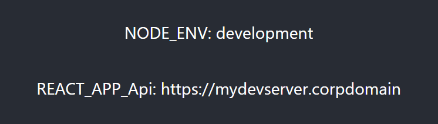
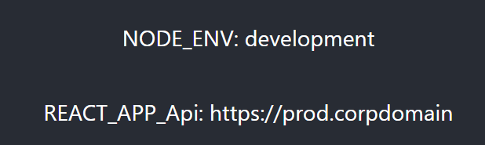

# Lerna React-Scripts Environment Variable Issue

This simple repo is to reproduce an issue [reported to the Lerna project](https://github.com/lerna/lerna/issues/3540).  I had problems when upgrading from Lerna 4 to Lerna 6 with my .env file being picked up properly, but .env.development, .env.*.local, etc. files not overriding.

.env has  `REACT_APP_Api=https://prod.corpdomain` while .env.development has `REACT_APP_Api=https://mydevserver.corpdomain`

For the following command:

    yarn lerna run start

Expected behavior (as it does in 4.0.0) would result in this page:

Actual behavior in 6.5.0 is:

It picks up value from .env but not the override from .env.development, though the echo'd NODE_ENV indicates it is indeed running as development.
